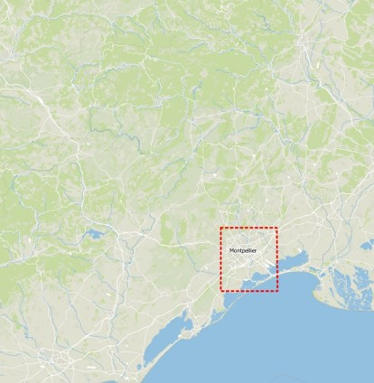
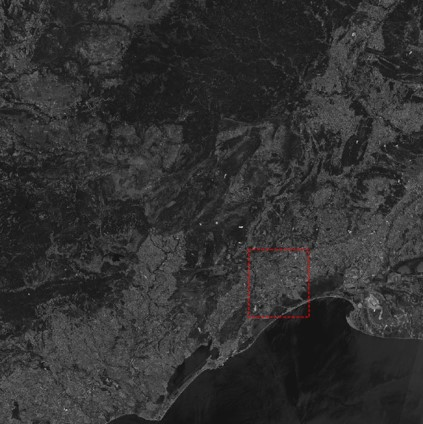
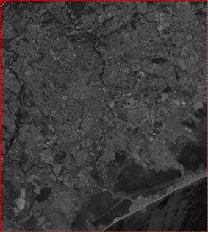
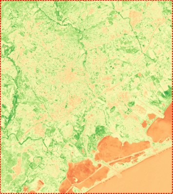
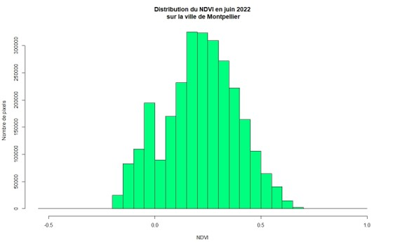

This project is , using Python for automation and R to process data.
It still requires to be developed in order to be used as a fully functionnal application.
It's purpose is to be used as a model for other projects.

Automation's steps:

  1- Fetch satellite raster data (Sentinel 2: [click here](https://scihub.copernicus.eu/dhus)) covering a specified mask. The query is looking for the least cloud coverage.
  
  
  
  2- Clip satellite data with the mask
  
  
  3- Process NDVI
  
  
  4- Open NDVI raster with R and process data distribution
  
  
  5- Write two rasters with NDVI value >25 and >50
  
  6- Display filtered NDVI raster on a Leaflet map, usin Folium plugin
  
  
Requirements:

  - Change paths according to your local environment
  - Python
  - R
